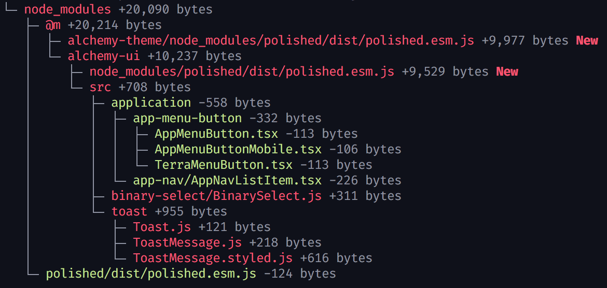
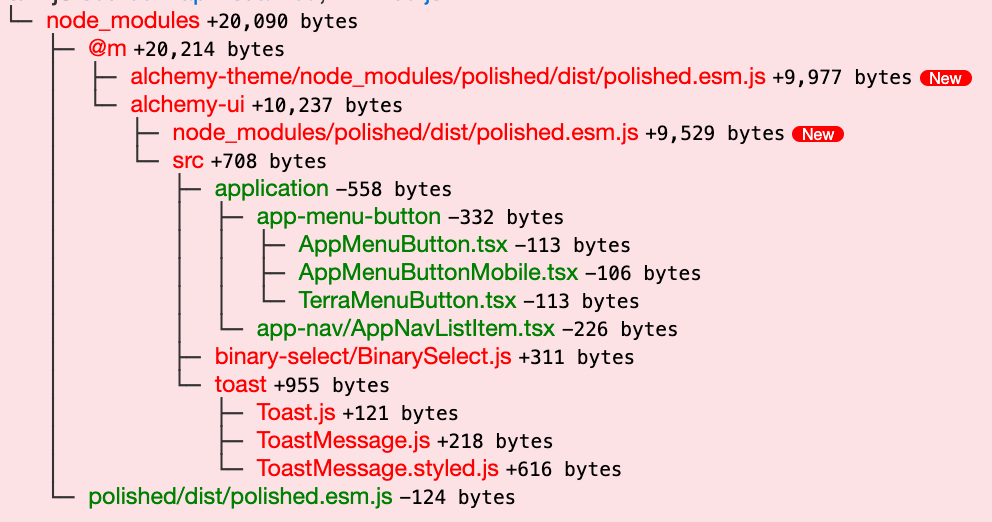
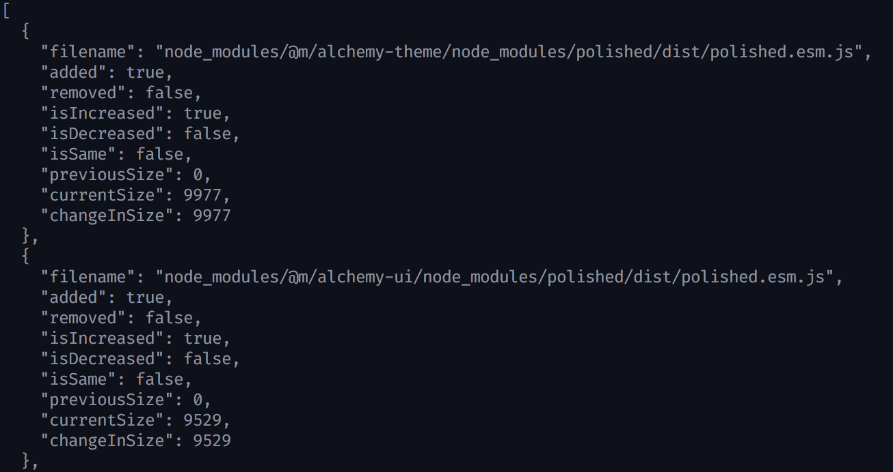

# source-map-diff


[![NPM version][npm-image]][npm-url]

> Compare current sourcemap to the previous to understand why it changed in size.

* Input can be local filenames or urls to javascript online.
* Output can be HTML, JSON, or color command line.



## Install

```
$ yarn add source-map-diff
```

## API



### sourceMapDiffAsHtml({ previousSrc, currentSrc }): Promise<string>

Returns a `Promise` for HTML output that can be put on a web page. Classnames are included but not styling.


### sourceMapDiffForConsole({ previousSrc, currentSrc })

Returns a `Promise` for color console output.

### sourceMapDiff({ previousSrc, currentSrc })

Returns a `Promise` for the following data:

```typescript
[
  // One of the following objects for every file in the bundle.
  {
    "filename": "node_modules/polished/dist/polished.esm.js",
    "added": true, // File was not in the previous bundle.
    "removed": false, // File was removed from the current bundle.
    "isIncreased": true, // File grew in size.
    "isDecreased": false, // File decreased in size.
    "isSame": false, // File did not change size.
    "previousSize": 0, // This file byte count in the previous bundle.
    "currentSize": 9977, // This file byte count in the current bundle.
    "changeInSize": 9977 // Change in bytes.
  }
]
```

## Command-line usage



```bash
$ source-map-diff --previousSrc <filename-or-url> --currentSrc <filename-or-url>
```

Optional
`--format html` to get the output as an HTML string.
`--format json` to get the output as JSON.


## Notes

* Size is always uncompressed bytes in the bundle, not size of the original source code.
* Bundlers often need to add helper functions and ways to reference chunks or functions in other bundles, but they don't include this data in the source map. We use the name "[generated]" for that code.
* You can compare any two bundles, they don't even need to be from the same web site. Compare your JS to a favorite site and see what dependencies you have in common.

## Related

- [source-map-explorer](https://github.com/danvk/source-map-explorer) - Create a visualization from the sourcemap. Source-map-diff uses this library to parse the source maps.

[npm-url]: https://www.npmjs.com/package/source-map-diff
[npm-image]: https://img.shields.io/npm/v/source-map-diff.svg
